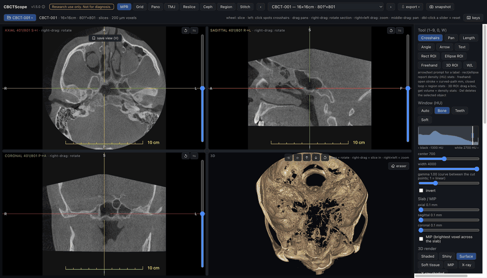
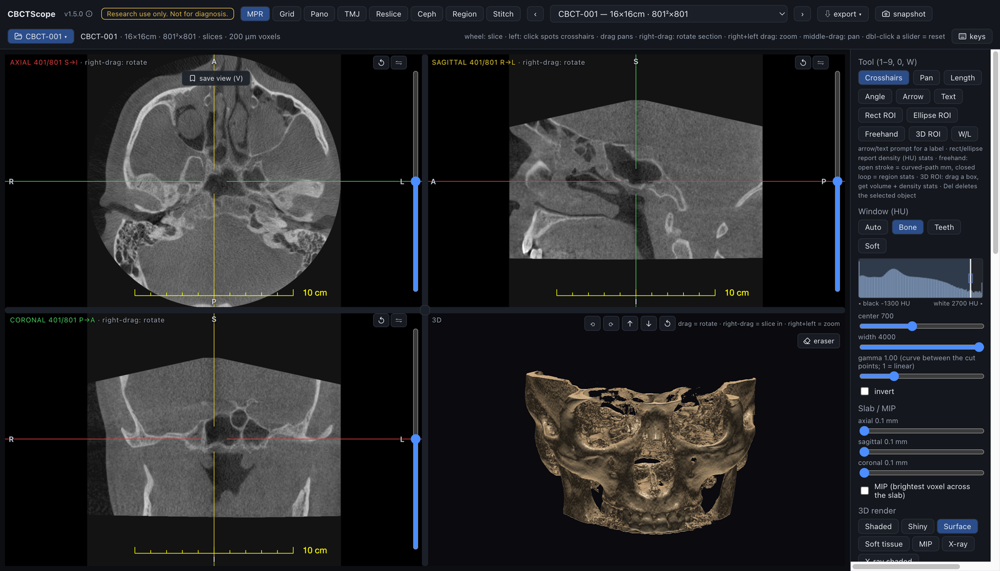
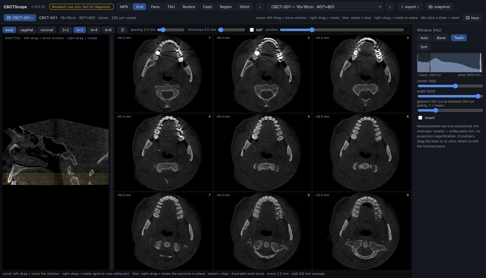
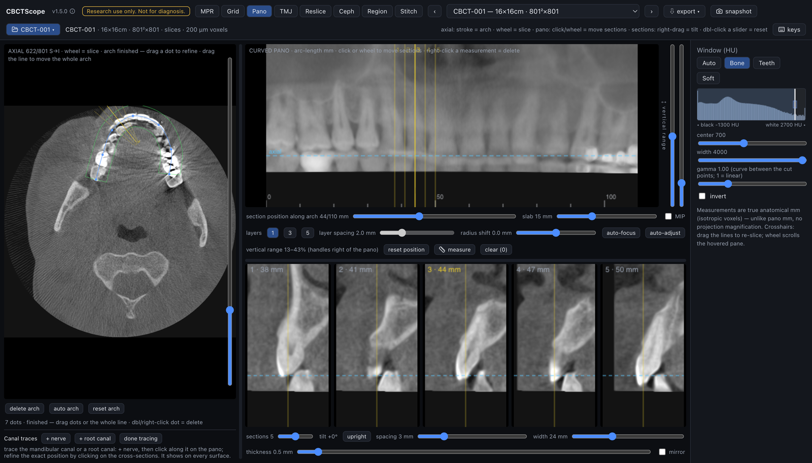

# CBCTScope

**A complete, local-first CBCT and 2D radiograph viewer, built by a
board-certified oral and maxillofacial radiologist. The first with native
AI-agent control.**

[](https://doi.org/10.5281/zenodo.21431452)



*Above: an agent driving the viewer in demo mode. Window preset, slice
navigation, the multi-slice grid, and the mode switches are MCP verbs sent by
the agent; the arch proposal and pano enhancement are the viewer's own
one-click tools. The volume is the built-in synthetic phantom, so no patient
data can appear, by construction.*

CBCTScope opens the CBCT exports already on your computer and reads them in
eight purpose-built modes: MPR with 3D rendering, multi-slice grid, curved
panoramic with nerve tracing, TMJ, freehand reslice, virtual cephalogram,
region growing with airway analysis, and two-volume stitching. It reads 2D
radiographs (panoramic, intraoral, CR and DX) in the same instrument, under
the same display settings. It is free, open source, and local-first: no
account, no cloud, no upload, ever. No agent is required; CBCTScope is a
complete standalone viewer.

It is also, to our knowledge, the first CBCT viewer an AI agent can drive
natively: through a built-in [MCP](https://modelcontextprotocol.io) server, an
agent opens scans, switches reading modes, sets the window, moves through
slices, and takes snapshots. The agent moves the camera. The human reads.

> **Research use only. Not a medical device.** CBCTScope visualizes and
> navigates volumes. It never produces findings, measurements-as-conclusions,
> or diagnoses, in the UI or over MCP. Do not use it for clinical
> decision-making.

## The interface at a glance

| MPR + 3D | Multi-slice grid | Curved panoramic |
|---|---|---|
| [](docs/media/thumb-mpr.png) | [](docs/media/thumb-grid.png) | [](docs/media/thumb-pano.png) |

Click any thumbnail for full resolution. Each reading mode has its own guide,
written the way a reader actually moves through a volume:
[docs/reading-modes](docs/reading-modes/). The full user manual, from
installation to the keyboard reference, lives in [docs/manual](docs/manual/).

## Run it

About five minutes, no technical background needed. CBCTScope is not an
installed app with an icon: it is a small local program you start once per
reading session, and your browser is the screen. Everything is undone by
deleting the folder.

1. **Install Node.js 22 or later** from [nodejs.org](https://nodejs.org):
   download the LTS installer, run it, accept the defaults. Node.js is the free
   runtime that runs the viewer, the way a browser runs a web page.
2. **Get CBCTScope.** Click the green **Code** button at the top of this page,
   choose **Download ZIP**, and unzip it somewhere you can find again (Desktop
   is fine). If you use git, `git clone` works as usual.
3. **Open a terminal in that folder.**
   On macOS: open Terminal (press Cmd-space, type "Terminal", press return),
   type `cd ` with a trailing space, drag the unzipped `cbctscope` folder onto
   the Terminal window, press return.
   On Windows: open the unzipped folder in Explorer, click the address bar,
   type `cmd`, press enter.
4. **Install and start.** Two commands, return after each. The first downloads
   the viewer's components; it runs once and takes a few minutes.

   ```sh
   npm install
   npm run demo
   ```

   On Windows the second command is `npm run dev` instead (`npm run demo` sets
   its flag in Unix syntax and the Windows shell rejects it). The viewer is
   identical; the difference is explained below.
5. **Open http://localhost:3810 in your browser.** A built-in **synthetic
   phantom** loads immediately: jaws, dental arches, teeth with enamel and
   pulp, a metal crown, airway, sinuses, and TMJ condyles, all procedurally
   generated. The full viewer works with zero patient data.

To stop the viewer, press Ctrl-C in the terminal or close its window. Next
session, only step 3 and the start command are needed.

**Demo mode vs. normal mode.** `npm run demo` never remembers a previously
opened scan, so a recording or screenshot session can never accidentally
surface a real case: it is a privacy guarantee, not a reduced feature set.
`npm run dev` is the same viewer but restores your last opened scan when it
starts. On first launch both show the phantom.

### If something goes wrong

- **`npm: command not found`** (or `'npm' is not recognized`): Node.js is not
  installed yet, or the terminal was opened before the install finished.
  Install it, then open a new terminal window and retry.
- **The start command warns that port 3810 is in use**: the viewer is already
  running in another terminal window. One is enough: just open
  http://localhost:3810, or stop the older one with Ctrl-C first.
- **"found N compressed DICOM file(s)"** when opening a scan: the viewer reads
  uncompressed DICOM only. Re-export from your scanner software with
  compression off.

## Opening your own scan

Click **open** in the viewer header and pick a CBCT export: a folder of DICOM
slices, a DICOMDIR tree, a single multiframe DICOM file, or one slice of a
series (the whole series opens). Any export your scanner software produces as
**uncompressed DICOM** works.

The scan is read **in place** from the folder you picked. Nothing is copied,
converted, or uploaded, and the full folder path never reaches the browser:
the header shows a short label built from the folder and file names, so name
your export folders the way you want to see them.

The native file dialog is macOS-only for now. On Windows or Linux, point the
running viewer at an export folder with one command in a second terminal
(forward slashes work in Windows paths):

```sh
curl -X POST http://localhost:3810/api/cbct/source -H "Content-Type: application/json" -d "{\"path\":\"C:/scans/patient-export\"}"
```

## Reading modes

| Mode | What it does |
|---|---|
| MPR | Orthogonal slices with crosshairs, oblique rotation, slab/MIP, measurements, 3D render with adjustable styles, clipping, and a render eraser |
| Grid | Many parallel slices of a rotatable stack on one screen |
| Pano | Draw the dental arch once, get a curved panoramic plus cross-sections, nerve tracing, and focal-trough control |
| TMJ | Both condyles side by side in axis-corrected sections |
| Reslice | A fresh slice stack along any drawn line or curve |
| Ceph | A virtual cephalogram, the volume projected flat like a film |
| Region | Region growing with HU presets, volume and density stats, airway analysis |
| Stitch | Rigid registration and fusion of two volumes of the same subject |

Per-mode reading guides live in [docs/reading-modes/](docs/reading-modes/).

### 2D radiographs

The viewer also opens single 2D radiographs (DICOM modality PX, DX, CR, or IO:
panoramic, digital and computed radiography, intraoral), uncompressed 16-bit files, the
same constraint as volumes. A radiograph gets a dedicated single-image view: window,
gamma, invert, cursor-centered zoom, pan, fit. Gray values are display-normalized to a
12-bit scale at load (radiographs carry no HU calibration), and MONOCHROME1 files are
flipped so bright is always radiopaque. The volumetric reading modes apply to volumes
only. This exists so multi-reader studies can read both image classes in one instrument
under identical display settings.

### Exporting

The volume header has an **export** menu with three client-side formats: a PNG slice
stack (a zip of one PNG per slice at the displayed window, plus a geometry `meta.json`),
a NIfTI volume (`.nii.gz`, HU values, for Slicer, ITK-SNAP, nibabel, MONAI), and an STL
surface mesh (marching cubes at a chosen HU threshold, honoring the 3D crop box, for
printing or CAD). Everything is computed in the browser and saved to this machine's
Downloads: nothing is uploaded, the same local-first constraint as reading.

## Privacy

The safe behavior is the only behavior the software has:

- Scans are read **in place** from the folder you pick. Nothing is copied or
  uploaded anywhere; there is no account, no telemetry, no hosted instance,
  and there never will be one.
- Everything, including the AI-agent connection, stays on this machine. In
  technical terms: the server binds to 127.0.0.1 and rejects any request whose
  Host or Origin is not loopback, so neither another device on your network
  nor a hostile web page in another tab (DNS rebinding, cross-site POSTs) can
  reach it.
- No absolute file paths reach the browser or the agent transcript. The UI
  shows a display label derived from the last folder and file names of what
  you opened, plus technical geometry only.
- The only writes are an app-data folder (`~/.cbctscope`) holding your
  annotation sidecars (labels, world-mm coordinates, HU statistics) and a
  pointer to the last source you opened, so the viewer can restore it. Never
  pixels. Demo mode writes neither.

## AI-agent control (MCP)

If you use an AI assistant that speaks MCP (Claude Code, Claude Desktop, and
others), it can drive the viewer for you: open a scan, switch reading modes,
set the window, step through slices, take snapshots to look at. It cannot do
more than that, by design: no tool returns a finding or an interpretation, and
no tool executes code, so the agent can never become the reader.

Start the viewer, open it in a browser, then register the MCP server with your agent host:

```json
{
  "mcpServers": {
    "cbctscope": {
      "command": "node",
      "args": ["/absolute/path/to/cbctscope/mcp/server.mjs"]
    }
  }
}
```

The agent gets eight verbs, all navigation or visualization: `open_scan`, `list_volumes`, `select_volume`, `set_view_mode`, `set_window_level`, `navigate_slice`, `snapshot`, `reset_view`. Details and the full contract: [docs/mcp.md](docs/mcp.md).

CBCTScope is one of a pair of agent-native instruments built on the same principle (bounded verbs for the agent, commit rights for the human); the other is [Quoin](https://github.com/rezamotaghi/quoin), a text editor for macOS where any agent may edit the buffer and only the human holds the save button. Both at [rezamotaghi.com](https://rezamotaghi.com).

## Why this exists

To our knowledge, CBCTScope is the first CBCT viewer with native AI-agent control. Neighboring projects exist and deserve credit: [dicom-mcp](https://github.com/ChristianHinge/dicom-mcp) and the [Flux Inc. DICOM MCP server](https://github.com/fluxinc/dicom-mcp-server) query PACS metadata over MCP, [dicom-viewer-mcp-app](https://github.com/ThalesMMS/dicom-viewer-mcp-app) prototypes MCP-driven DICOM slice rendering, and [mcp-slicer](https://github.com/zhaoyouj/mcp-slicer) drives 3D Slicer through raw Python execution. None of them is a purpose-built CBCT reading environment, and none constrains the agent to a small set of clinical navigation verbs. CBCTScope does both: a dental and maxillofacial reading workflow, plus an agent surface that is deliberately navigation-only.

## Development

```sh
npm run dev          # dev server on :3810
npm run typecheck    # tsc
npm run lint         # eslint
npm test             # vitest: geometry, reformats, registration, region growing, HU windowing, phantom, manual + citation drift
npm run build        # production build
```

Built on [Cornerstone3D](https://www.cornerstonejs.org/) and Next.js. All rendering styles, reading workflows, and reconstruction math are original, from-scratch implementations informed by clinical reading practice; the project contains no vendor code, assets, or documentation.

## Author

Built by [Dr. Reza Motaghi](https://rezamotaghi.com/research), board-certified
oral and maxillofacial radiologist, 100,000+ studies reported. CBCTScope is
the viewer I read with. If you use it in research, please cite it (see
[CITATION.cff](CITATION.cff)).

## License

[AGPL-3.0-or-later](LICENSE). Free to use, study, and modify. If you build a product or
service on this code, its source must be open under the same terms.

For uses the AGPL does not fit (closed-source products, commercial integration), a
separate commercial license is available: reach me through the contact page at
[rezamotaghi.com/contact](https://rezamotaghi.com/contact).
