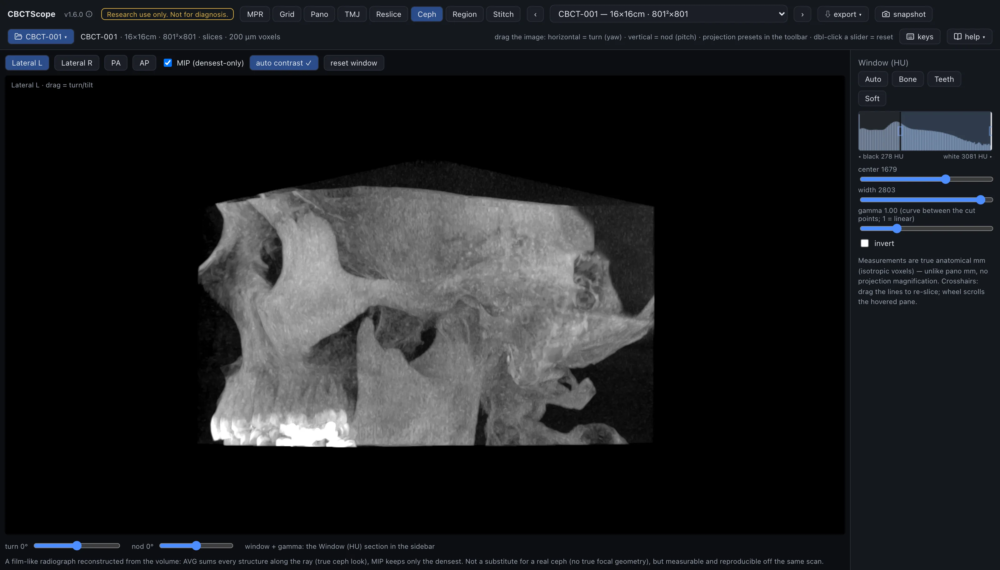

# Ceph

> **At a glance**
> - **The question:** an overall skeletal impression in a familiar projected radiographic
>   format, reproducible off the same scan.
> - **Start:** pick a projection preset (**Lateral L**, **Lateral R**, **PA**, or **AP**),
>   click **auto contrast**, then choose the average projection or **MIP**.
> - **Three gestures:** drag on the image horizontally to turn the head and vertically to
>   tilt it; the turn and tilt sliders do the same numerically; double-click a slider to
>   zero it.
> - **Leave it for:** any ambiguity of superimposition (MPR is one mode switch away), and
>   landmarks, tracing, or measurements, which this mode does not have.

## What this mode is for

Ceph renders a virtual cephalogram: the whole volume projected flat along one viewing
direction, like a film. Every structure along each ray is integrated into one 2D
radiograph, so the result reads like a conventional cephalometric or skull projection
reconstructed from the same scan. It answers the projection questions: an overall
skeletal impression in a familiar radiographic format, and a reproducible 2D image that
can be regenerated at exactly the same geometry from the same volume.

## Gestures

| Gesture | Where | Action |
|---|---|---|
| Horizontal drag | the image | Turn the head about the vertical axis |
| Vertical drag | the image | Tilt (sagittal) |
| Double-click a slider | controls | Zero it |

While dragging, the projection renders at a coarse stride and refines to full resolution
when you let go. The current turn and tilt are shown on the image.

## The controls

| Control | Options or range | What it does |
|---|---|---|
| Projection presets | Lateral L, Lateral R, PA, AP | Lateral L is the profile looking from the left, Lateral R the profile looking from the right, PA the front (postero-anterior), AP the front (antero-posterior). Picking a preset zeroes the rotation sliders. |
| MIP (densest-only) | checkbox | Unchecked, the projection is the average along each ray, the film-like look with every structure summed; checked, only the densest structure per ray survives, a bone-forward look. |
| turn | -180 to 180 degrees | Rotation about the vertical axis. |
| sagittal tilt | -60 to 60 degrees | Tilt. |
| Contrast | the shared Window section | The cephalogram is windowed by the sidebar's shared Window section, one set of center, width, and gamma controls for the whole app, so the numbers you read there are the numbers this image uses. The shared invert checkbox produces the film-negative rendering. |
| auto contrast | button | Computes a window from the projection's own densities (the projected values are not slice HU, so the volume window is usually not the right one) and writes it into that shared section; its check mark shows only while that window is still active. |
| reset window | button | Returns to the automatic volume window. |
| snapshot | header button | Saves the current cephalogram with a caption carrying the volume id, the projection name, and the date. |

## A reading workflow

1. Pick the preset that matches the question: a lateral projection for the profile view,
   PA or AP for the frontal view.
2. Run auto contrast first; the integrated projection has its own density range and the
   slice window rarely suits it.
3. Choose the blend for the purpose: the average projection for the familiar
   radiographic appearance with soft-tissue outline, MIP when only the densest
   structures should survive superimposition.
4. Use small turn and tilt corrections to compensate for head positioning in the
   scanner, so bilateral structures superimpose the way a positioned film would show
   them.
5. Read the projection as you would the corresponding radiograph, keeping in mind that
   everything along each ray is superimposed.
6. Resolve any ambiguity of superimposition in MPR: the same volume is one mode switch
   away, and that is the advantage over a film.
7. Adjust gamma when the midtones need lifting or compressing after the window is set.
8. Save the PNG when the projection itself is the record; the same geometry can be
   reproduced later from the turn and tilt readouts.

## Over MCP

`open_scan`, `list_volumes`, `select_volume`, `set_view_mode` (mode `ceph`),
`set_window_level`, and `snapshot` apply. `set_window_level` adjusts the shared window
the cephalogram is rendered with; auto contrast is an on-screen control that writes
into the same shared window. `navigate_slice` has nothing to move here (it works in MPR, grid, and pano) and answers with a clear error. Example sequence: `set_view_mode` to
`ceph`, `set_window_level` with `invert: true` for a film-negative look, `snapshot`.

## Limits

This is a parallel projection of the volume, not a true cephalostat exposure: there is no
focal-spot geometry and none of the projective magnification a film device produces, so
it is measurable and reproducible off the same scan but not interchangeable with a
device-acquired cephalogram. There are no landmark or tracing tools in this mode, and no
measurement tools; it produces an image, nothing more. CBCTScope is navigation and
visualization only: no findings, no diagnoses. Research use only; not a medical device.
