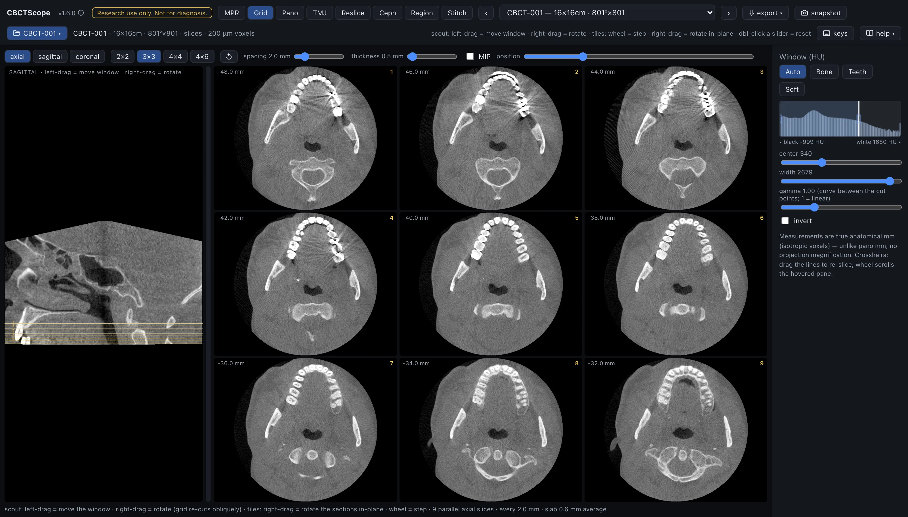

# Grid

> **At a glance**
> - **The question:** show this whole region slice by slice at a glance, at a chosen
>   spacing and any angle, the way a printed multi-slice sheet would.
> - **Start:** pick the plane and a grid size, set the window, then drag the section
>   window over the region on the scout and set the spacing so the stack covers it.
> - **Three gestures:** on the scout, left-drag moves the section window and right-drag
>   rotates the stack through the anatomy; the wheel, anywhere in the mode, steps the
>   window by one spacing.
> - **Leave it for:** measurements, annotations, and saved views, which live in MPR.

## What this mode is for

Grid shows many parallel slices of one stack on one screen: a chosen number of images at a
chosen spacing and slab thickness, cut along the axial, sagittal, or coronal direction, or
along any oblique direction you rotate into. It answers the survey question: "show me this
whole region, slice by slice, at a glance," the way a printed multi-slice sheet would,
with the added ability to re-angle the entire stack through the anatomy.

## Gestures

| Gesture | Where | Action |
|---|---|---|
| Left-drag or click | scout | Grab the section window and move it |
| Right-drag | scout | Rotate the scout image itself: the section lines stay put on screen while the anatomy turns under them, and the grid re-cuts obliquely through the rotated anatomy, with a live degree chip during the drag |
| Wheel | anywhere in the mode | Step the whole window by one spacing unit |
| Double-click a slider | controls | Reset it |

The tiles themselves are display-only.

## The controls

| Control | Options or range | What it does |
|---|---|---|
| Plane | axial, sagittal, coronal | The initial cutting direction. Switching planes straightens a rotated stack (announced briefly in the on-screen chip) but keeps your window position along the new axis; re-clicking the already-active plane does nothing, so a tuned oblique cannot be wiped by a stray click. The ↺ button straightens in place. |
| Grid size | 2x2, 3x3, 4x4, 4x6 | The tiles on screen. Each tile is labeled with its offset in mm from the stack center and a tile number that matches the numbered section lines on the scout. |
| spacing | 0.5 to 10 mm | The distance between consecutive slices in the stack. |
| thickness | 0.1 to 10 mm | The slab averaged into each slice; the MIP checkbox takes the brightest voxel across the slab instead of the average. |
| reset orientation | button | Back to the straight orthogonal stack after any rotation. |
| position | slider | Moves the whole slice window along the stack normal. |
| Scout pane | left | The control surface: the perpendicular reference view (a sagittal scout for an axial grid, an axial scout otherwise) with one numbered line per tile. |
| Window | shared sidebar | The shared Window (HU) panel applies here, including the presets, the histogram cut lines, center and width, gamma, and invert. |
| Status line | under the grid | Restates the current geometry: how many parallel slices, at what spacing, with what slab, averaged or MIP. |

## A reading workflow

1. Pick the plane that matches the question, and a grid size that fits the extent of the
   region: a small grid for a focused area, 4x6 for a long sweep.
2. Set the window before reading: Bone or Teeth for skeletal review, Soft for the
   soft-tissue survey.
3. On the scout, drag the section window over the region of interest, then set spacing so
   the stack covers it edge to edge.
4. Choose spacing no larger than the smallest structure you want to be sure of catching,
   or step the window with the wheel so consecutive positions overlap.
5. If the anatomy runs oblique to the standard planes, right-drag on the scout until the
   stack cuts along it, and use "reset orientation" to return.
6. Read the tiles in numbered order and cross-check any tile against the scout: the
   numbered line shows exactly where that slice cuts.
7. Keep the slab thin for fine detail; use a thicker slab, or MIP, when continuity of a
   high-density structure across noise matters more than sharpness.
8. For the record, switch to MPR and use its snapshot and measurement tools at the
   position identified here.

## Over MCP

`open_scan`, `list_volumes`, `select_volume`, `set_view_mode` (mode `grid`), and
`set_window_level` apply; `snapshot` captures the scout and all tiles as laid out.
`navigate_slice` moves the window centre along the grid's plane: `index` is the centre
slice in the pane count (unrotated grid), `delta` steps whole grid spacings like the
wheel, and `pane` switches the plane. `viewer_state` reports the plane, the centre slice,
the tile count and spacing, and whether the grid is rotated (then the index runs along the
oblique normal). A plain `reset_view` has no camera to reset in this mode; `reset_view`
with `full: true` still returns the shared window to its defaults. Example sequence:
`set_view_mode` to `grid`, `set_window_level` preset `Bone`, `navigate_slice` with
`pane: "coronal"` and an `index`, `snapshot`.

## Limits

Grid is a survey surface, not a measurement surface: it has no calipers, no annotations,
and no saved views; those live in MPR. Tiles cannot be individually windowed or zoomed.
The stack geometry (count, spacing, thickness, rotation) is set with the on-screen
controls only, not over MCP. CBCTScope is navigation and visualization only: no findings,
no diagnoses. Research use only; not a medical device.
