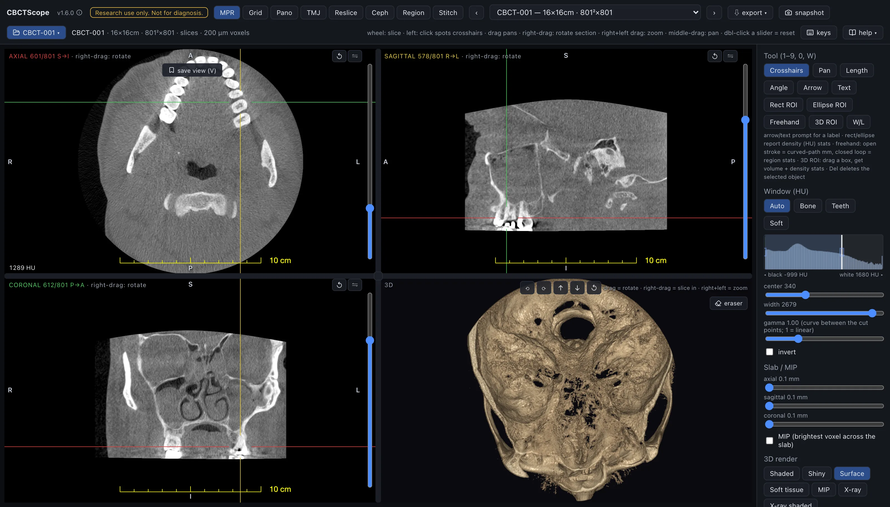

# MPR

> **At a glance**
> - **The question:** what is here, in three dimensions: localize it, follow it across
>   planes, measure it in true millimetres, present it. The default read; when in doubt,
>   start here.
> - **Start:** open the scan, press `R` for orthogonal planes, pick a window preset
>   (**Bone**, **Teeth**, **Soft**, or **Auto**), click a structure to spot the crosshairs.
> - **Three gestures:** the wheel scrolls the hovered pane; the left button runs the tool
>   (with **Crosshairs**, a click spots the crosshairs and a drag pans); right-drag rotates
>   the section. On the 3D pane, left-drag orbits and right-drag cuts in.
> - **Leave it for:** a slice-by-slice survey (Grid), the dental arch (Pano), the condyles
>   (TMJ), any other cut (Reslice), a film-like projection (Ceph), a density region
>   (Region), two volumes of one subject (Stitch).

## What this mode is for

MPR is the default read: three orthogonal slice panes (axial, sagittal, coronal) with
linked crosshairs, plus a 3D render in the fourth pane. It answers the general question
"what is here, in three dimensions": localizing a structure, following it across planes,
measuring it in true millimetres, and presenting it as a labeled figure. Everything else
in the viewer is a specialization; when in doubt, start in MPR.

## Gestures and keys

| Gesture or key | Where | Action |
|---|---|---|
| Wheel | slice pane | Scroll the hovered pane |
| Left click or drag | slice pane | The active tool; with Crosshairs, a click spots the crosshairs to that point and a drag pans |
| Shift + left click | slice pane | Select an annotation |
| Right-drag | slice pane | Rotate the section about the crosshair center; all three planes rotate rigidly and stay mutually orthogonal, with a live degree chip |
| Shift + right-drag, or right+left chord drag | slice pane | Zoom |
| Middle-drag | slice pane | Pan |
| Double-click | any pane | Maximize the pane; again to restore the 2 by 2 layout |
| Left-drag | 3D pane | Rotate the render |
| Middle-drag | 3D pane | Pan |
| Right-drag | 3D pane | Cut progressively into the render (the cutaway, below) |
| Right+left chord drag | 3D pane | Zoom |
| `1` to `9`, `0` | anywhere | Tools in palette order (Crosshairs to 3D ROI) |
| `W` | anywhere | The window/level tool |
| `R` | anywhere | Reset orientation |
| `C` | anywhere | Plane lines on or off |
| `O` | anywhere | Overlay master switch |
| `V` | anywhere | Save the current view |
| `Del` | anywhere | Delete the selected object |
| `N` / `P` | anywhere | Next or previous volume |
| Double-click a slider | sidebar | Reset it |

## The controls

**Panes.** The screen is a 2 by 2 grid: AXIAL, SAGITTAL, CORONAL, 3D. Each slice pane
shows its slice counter with the direction the count runs (`622/801 S→I`: slice 1 is the
most superior; coronal counts P→A, sagittal R→L; the letters follow the live camera, so
an obliqued pane reports the direction it actually scrolls along), patient-orientation
letters computed from the live camera (they stay correct after oblique rotation), a live
HU readout under the cursor (a 3 by 3 by 3 neighborhood mean), a slice slider on the
right edge, and a flip button that mirrors the viewing direction.

**Tool palette** ("Tool (1-9, 0)"): Crosshairs, Pan, Length, Angle, Arrow, Text, Rect
ROI, Ellipse ROI, Freehand, 3D ROI, on hotkeys 1 through 9 and 0; W/L on `W`. Arrow and
Text prompt for a label. Rect and Ellipse ROIs report density (HU) stats. A Freehand open
stroke measures a curved path in mm; closing the loop turns it into a region with HU
stats. 3D ROI drags a rectangle on any slice pane and extends it through the slice by the
"box depth" slider (1 to 60 mm, default 10), returning volume and density stats with an
outline in the 3D pane. Del deletes the selected object.

**Window (HU).** Presets Auto, Bone, Teeth, Soft; a histogram whose black and white cut
lines can be dragged directly (below black renders black, above white renders white);
center and width sliders; a gamma slider (1 = linear, double-click resets); an invert
checkbox.

**Slab / MIP.** Per-pane slab thickness (0.1 to 20 mm) and a MIP checkbox that takes the
brightest voxel across the slab instead of the average.

**3D render, style.** A style picker with two parametric groups, Styles (Shaded, Shiny,
Surface, Soft tissue, MIP, X-ray, X-ray shaded, B&W X-ray) and CBCT tuned (bone + teeth,
teeth high density, translucent bone with solid teeth), plus generic CT presets that
apply as-is without the adjust sliders. Surface, a bone-toned isosurface, is the default.
The shaded styles light off the render's opacity cloud with local ambient occlusion, so
sockets and interproximal gaps self-shadow.

**3D render, adjust** (parametric styles): cut-off threshold (densities below stay
transparent; also draggable on the render histogram; double-click returns to the style's
default), transparency, contrast, brightness, pseudo-color (none, hot, cool, rainbow),
depth enhancement (flat interiors fade, surfaces pop), smooth 3D surface (the 3D pane
renders from a lightly denoised copy of the volume; slice views always keep the original
voxels; on by default), cinematic light (in-volume light scattering for soft shadows,
slower to orbit), a light-follows-camera toggle with fixed light azimuth and height
sliders when off, and an optional soft-tissue overlay (a skin-toned translucent band with
its own threshold and opacity). While the camera moves, the render temporarily coarsens
its sampling and sharpens again on idle. Perspective projection is a separate toggle
(off = orthographic; toggling re-homes the 3D camera). Plane indicators draw the three
section planes and a bounding box inside the render.

**Crop 3D.** Per-axis keep ranges (R to L, A to P, I to S) that crop the render only; the
slices are unaffected. "Un-crop + clear cuts" restores the full volume.

**Cutaway.** Right-drag on the 3D pane opens a cut plane facing the camera; dragging up
pushes it deeper, down backs it out. Later right-drags resume the same cut from its
current depth; backing out past zero removes it (so does the scissors chip), and only
then does a new drag open a fresh plane facing wherever the camera is now.

**Render eraser.** The "eraser" button on the 3D pane turns left-drag into a brush
(radius 1 to 12 mm) that erases what you touch on the render. It edits a 3D-only copy of
the voxels; the slice panes never change. Undo, redo, and revert are on the same toolbar.

**My 3D presets.** Save the current render settings under a name; the star marks one as
the default applied on app start.

**Snapshot and views.** "snapshot" (header) saves the visible layout (annotations
included) as a PNG. "save view (V)" stores all four cameras plus window and render
settings under a name; the objects panel restores it in one click. Annotations, saved
views, and 3D ROIs persist per volume in the evidence sidecar and return when the volume
is reopened.

## A reading workflow

1. Open the scan and confirm the volume label, field of view, and voxel size in the header.
2. Press R to start from orthogonal planes, then set the window: Bone or Teeth for the
   skeletal read, Soft for the soft tissues, Auto to return to the volume's own window.
3. Scroll each pane through its full extent once before concentrating on any one finding,
   so the whole imaged volume is reviewed.
4. Use the crosshairs to localize: click a structure in one pane and read it in the other
   two at the same point.
5. When a structure does not lie in an orthogonal plane, right-drag to rotate the section
   about it; press R when done to return to the standard planes.
6. Window for bone before assessing cortical outlines, and widen the slab with MIP when a
   thin high-density structure needs to stand out from noise.
7. Keep the slab thin (near 0.1 mm) when judging fine structures; a thick slab averages
   small detail away.
8. Measure with Length, Angle, or an ROI; measurements here are true anatomical mm with no
   projection magnification.
9. Save a named view at each finding's exact presentation, then take a snapshot for the
   record.

## Over MCP

Every verb applies here. `navigate_slice` moves the three panes, `set_3d_style` picks
the 3D pane's style, and the saved-view verbs (`list_views`, `goto_view`, `save_view`)
work on this mode's views; a view the agent saves carries the **agent** badge.
`viewer_state` reports each pane's slice in the pane count with its direction. A typical
sequence: `open_scan` with a local export path (or `pick_scan` to let the reader choose),
`list_volumes` to read the geometry, `select_volume`, `set_view_mode` to `mpr`,
`set_window_level` with the `Bone` preset, `navigate_slice` with `pane: "axial"` and an
`index` or `delta`, then `snapshot`. `reset_view` returns the cameras to orthogonal; with
`full: true` it also resets window, inversion, and gamma. The `mpr-survey` and
`replay-views` prompts are this workflow, scripted.

## Limits

MPR displays and measures; it does not interpret. Slice-level ROI statistics are raw HU
numbers, and CBCT HU calibration is approximate by nature, so treat absolute values as
starting points rather than calibrated densitometry. The render eraser and the cutaway
alter the 3D presentation only and never modify the slice data. CBCTScope is navigation
and visualization only: no findings, no diagnoses. Research use only; not a medical
device.
