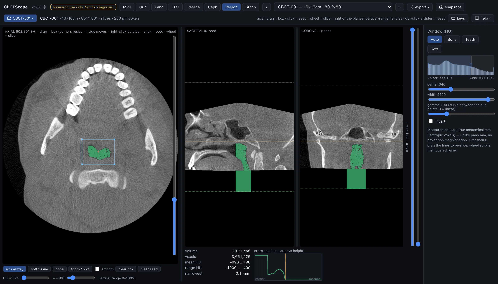

# Region

> **At a glance**
> - **The question:** how large is this connected low-density or high-density region, and
>   where is it narrowest? The upper airway is the canonical case.
> - **Start:** scroll the scout to the middle of the target, pick a density preset
>   (**air / airway**, **soft tissue**, **bone**, or **tooth / root**), drag a bounding box
>   just around the target, then click a seed well inside it.
> - **Three gestures:** on the scout, drag draws the box, a click drops the seed, and the
>   wheel scrolls the slice.
> - **Leave it for:** anything a density threshold cannot separate: the grow follows
>   density, not anatomy, and its numbers describe the mask, nothing more.

## What this mode is for

Region segments a connected structure by density: draw a bounding box on the axial
scout, pick a density range, click a seed inside the target, and every connected voxel in
range floods out into a mask shown over all three orthogonal planes, with its volume,
density statistics, and a cross-sectional area profile by height. It answers the
quantitative navigation questions: "how large is this connected low-density or
high-density region, and where is it narrowest?", with the upper airway as the canonical
case.

## Gestures

| Gesture | Where | Action |
|---|---|---|
| Drag | scout | Draw the bounding box; it limits how far the fill can spread in-plane, and without a box the whole slice extent is used |
| Click | scout | Drop the seed; it must land on a voxel inside the density range, or the grow reports nothing and asks for a better seed or a wider range |
| Wheel | scout | Scroll the slice; the caption uses the MPR axial count (`S→I`, slice 1 at the top) |
| Double-click a slider | controls | Reset it |

## The controls

| Control | Options or range | What it does |
|---|---|---|
| Density presets | air / airway (-1024 to -400 HU), soft tissue (-200 to 300 HU), bone (400 to 3200 HU), tooth / root (900 to 2600 HU) | The density range the fill may include. |
| HU sliders | two sliders | Set the range manually; touching them clears the preset highlight. |
| smooth | checkbox | One pass of morphological closing that fills pinholes in the mask. |
| depth | plus or minus 5 to 200 slices | How many slices above and below the seed the grow may reach, the vertical extent of the bounding box. |
| clear | button | Removes the box, seed, mask, and statistics. |
| Results panel | read-only | Volume in cm3, voxel count, mean HU with standard deviation, HU range, and the narrowest cross-sectional area in mm2. A warning appears if the grow hits the 4-million-voxel cap, meaning the box or range should be tightened. |
| Cross-sectional area vs height | graph | The masked area at each height, inferior to superior, with the narrowest non-empty slice flagged; the same level is marked with a dashed line on the sagittal and coronal panes, which are cut through the seed and show the mask as a green overlay. |
| Window | shared sidebar | The shared Window (HU) presets, center, width, and invert control the underlying grayscale; the mask overlay is independent of the window. |

## A reading workflow

1. Scroll the scout to a level through the middle of the target and pick the density
   preset that matches it, or set the HU range by hand.
2. Drag a bounding box just around the target, tight enough that the fill cannot escape
   into connected structures of similar density outside the region of interest.
3. Click a seed well inside the target, away from its walls, so partial-volume voxels at
   the boundary do not decide where the fill starts.
4. Check the mask on all three planes before trusting any number: the statistics
   describe the mask, and the mask is only right if it covers the target and nothing
   else.
5. If the mask leaks, tighten the box, narrow the range, or reduce the depth; if it
   under-fills, widen the range or enable smooth to close pinholes.
6. For an airway read: air preset, a box around the pharynx, seed in the air column; the
   graph then gives the area at each height with the narrowest slice flagged.
7. Read the narrowest level on the sagittal and coronal panes at the dashed line, not
   only on the graph.
8. Record the numbers together with the range and box that produced them; a segmentation
   statistic without its threshold settings is not reproducible.

## Over MCP

`open_scan`, `list_volumes`, `select_volume`, `set_view_mode` (mode `region`),
`set_window_level`, and `snapshot` apply; the snapshot captures the scout, the seed
planes with the mask, and the on-screen panels. `navigate_slice` has nothing to move here (it works in MPR, grid, and pano) and answers with a clear error; box, seed,
and range are on-screen controls with no agent verb, and no verb returns the statistics.
Example sequence: `set_view_mode` to `region`, `snapshot`.

## Limits

The grow is thresholded connectivity, nothing more: it follows density, not anatomy, and
it will happily include anything connected and in range inside the box. CBCT HU values
are approximate by nature, so the preset ranges are starting points and the absolute
statistics are not calibrated densitometry. Airway dimensions also depend on posture,
breathing phase, and tongue position at acquisition, which a single static scan cannot
standardize. The mask is session state and is not saved. CBCTScope is navigation and
visualization only: no findings, no diagnoses. Research use only; not a medical device.
