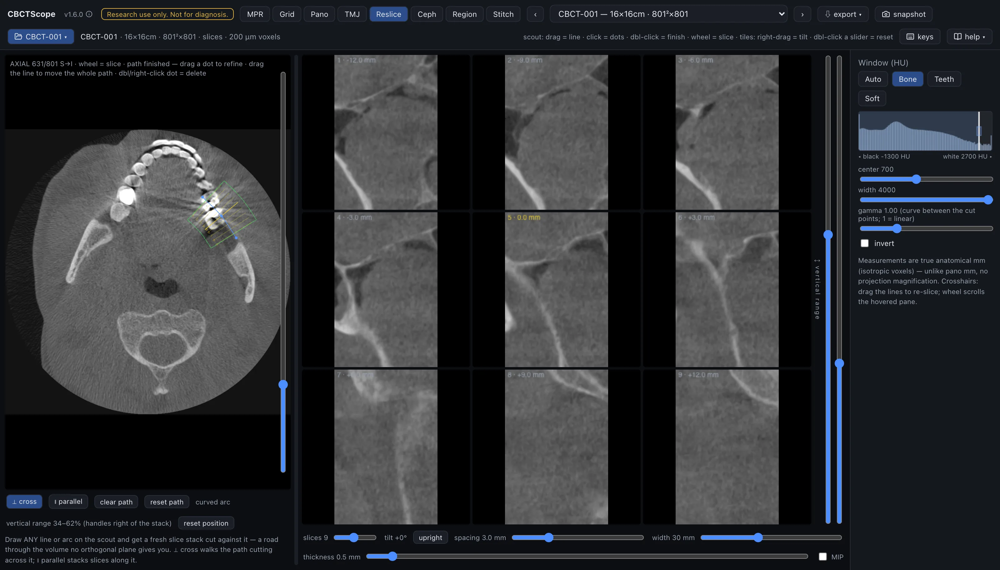

# Reslice

> **At a glance**
> - **The question:** cut a fresh slice stack along this exact structure, a straight line
>   at any angle or a curved arc, where the fixed planes do not reach.
> - **Start:** scroll the scout to the slice where the structure is best defined, draw the
>   path (drag a stroke, or click points: two make a line, three or more an arc),
>   double-click to finish, then choose the **cross** or **parallel** output shape.
> - **Three gestures:** on the scout, drag or click draws the path and the wheel scrolls;
>   right-drag on an output tile tilts the stack.
> - **Leave it for:** measurements, which live in MPR; the dental arch (Pano) and the
>   condyles (TMJ) have their own, specialized versions of this mode.

## What this mode is for

Reslice generates a fresh 2D slice stack along any path you draw on the axial scout: a
straight line at any angle, or a curved arc. It answers the question the fixed planes
cannot: "cut me a stack of slices along this exact structure," whether that is serial
cross-sections marching down a drawn line or a stack of parallel reformats through a
chosen direction. It is the general-purpose version of what Pano does for the dental
arch and TMJ does for the condyles.

## Gestures

| Gesture | Where | Action |
|---|---|---|
| Drag a stroke, or click points | scout, while placing | Draw the path: two points make a straight line, three or more make a curved arc |
| Double-click | scout, while placing | Finish the path |
| Drag a dot | scout, once finished | Refine the path |
| Drag the line | scout, once finished | Move the whole path |
| Right-click a dot | scout, once finished | Delete it |
| Wheel | scout | Scroll the slice; the caption uses the MPR axial count (`S→I`, slice 1 at the top) |
| Right-drag | any output tile | Rotate the stack (tilt) |
| Drag the divider | between scout and stack | Resize; double-click resets |
| Double-click a crop handle | stack edge | Reset it |

The path has the same two-phase lifecycle as the pano arch: while placing, strokes and
clicks add to it; once finished, clicks are inert and only the dots and the line respond.
The path and the scout slice persist per volume.

## The controls

| Control | Options or range | What it does |
|---|---|---|
| clear path | button | Removes the whole path and returns to placing. |
| Reset path | button | Returns the path to its position as of the last finish. |
| Output shape | cross | Planes perpendicular to the path, marched along it. On a line this walks the line cutting across it; on a curve it steps along the arc cutting perpendicular cross-sections, as in the Pano cross-sections. |
| | parallel | Planes containing the path direction, offset sideways. On a line this is a stack of parallel oblique reformats; on a curve it is the arc swept at a series of sideways shifts, a stack of curved reformats. |
| slices | 3 to 16 | How many slices the stack holds. |
| distance | 0.5 to 10 mm | The distance between slices. |
| width | 10 to 60 mm | The width of each slice. |
| thickness | 0 to 10 mm | Averaged into each slice. |
| MIP | checkbox | Brightest voxel instead of the average, for straight-line stacks and parallel curved reformats. |
| vertical crop | two handles on the right edge of the stack | Trim its top and bottom; the kept band scales into the pane, and double-click on a handle resets it. |
| Stack rotation | right-drag on any output tile | The same sweep gesture as the MPR and grid rotations. The frame is rigid: the scout goes oblique to match and the drawn path projects onto it dashed while tilted. |
| reset position | button | Returns the tilt upright and the vertical crop to full, leaving the path, stack parameters, and the divider untouched. |
| save stack | button | Saves the whole stack as one PNG, tiled, with a caption line carrying the volume id, stack geometry, and date. |
| Scout markers and tiles | scout, tiles | The scout draws the path plus numbered markers showing where each output slice cuts, and outlines the sampled band in green, showing exactly the anatomy the stack cuts through; the output tiles carry the matching number and the offset in mm from the path midpoint. The middle slice of the stack is highlighted on both sides. |
| Window | shared sidebar | The shared Window (HU) presets, center, width, and invert apply. |

## A reading workflow

1. Scroll the scout to the slice where the structure of interest is best defined and draw
   the path along it: a line for a straight course, an arc for a curved one.
2. Choose the output shape from the question: cross-sections to examine a structure's
   short axis repeatedly along its length, parallel to view it in its own long-axis
   plane at several depths.
3. Set distance so the stack spans the structure with the sampling you need; the slice
   count times the distance is the total coverage, centered on the path midpoint.
4. Set width generously at first, then tighten it once the stack is centered where it
   should be.
5. Keep thickness near zero for fine detail, and add thickness or MIP when continuity
   through noise matters more than edge sharpness.
6. Use the numbered markers on the scout to keep every output tile anchored to its
   position in the anatomy.
7. Trim the vertical range to the region of interest so each slice is filled with
   relevant anatomy.
8. Save the stack as a PNG when the series itself is the record, or reproduce the key
   position in MPR for measurements.

## Over MCP

`open_scan`, `list_volumes`, `select_volume`, `set_view_mode` (mode `reslice`),
`set_window_level`, and `snapshot` apply; the snapshot captures the scout and the output
stack as laid out. `navigate_slice` has nothing to move here (it works in MPR, grid, and pano) and answers with a clear error; the path is drawn by hand and has no
agent verb. Example sequence: `set_view_mode` to `reslice`, `set_window_level` preset
`Bone`, `snapshot`.

## Limits

The stack exists only after a path is drawn, and its geometry is exactly the drawn
geometry: there is no automatic alignment to anatomy. The path is drawn on one axial
slice, so the cutting frame is defined in that plane; structures whose course changes
out-of-plane may need the path redrawn at another level. There are no measurement tools
here; measure in MPR. CBCTScope is navigation and visualization only: no findings, no
diagnoses. Research use only; not a medical device.
