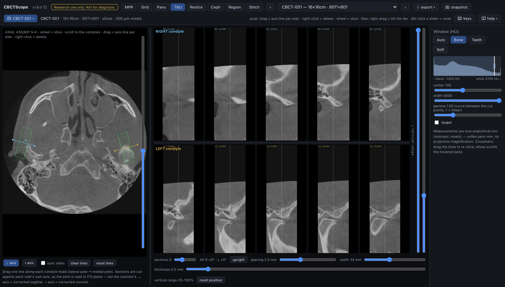

# TMJ

> **At a glance**
> - **The question:** what does each condyle look like in sections corrected to its own
>   axis, and how do the two sides compare?
> - **Start:** scroll the scout to the level where both condylar heads are widest, drag
>   one line per condyle along its long axis (lateral pole to medial pole), set a bone
>   window; the sections appear as soon as a line exists.
> - **Three gestures:** on the scout, drag draws or moves an axis line and right-click
>   deletes it; the wheel scrolls the scout slice; right-drag on a section tilts that
>   side's fan.
> - **Leave it for:** measurements, which live in MPR at the same location.

## What this mode is for

TMJ reads both temporomandibular joints side by side, each in sections corrected to its
own condylar axis. The two condylar heads rarely align with the scanner's sagittal and
coronal planes, and they rarely align with each other; this mode cuts each side against
its own long axis, so the joint is read in its plane, not the scanner's. It answers the
paired question: "what does each condyle look like in properly oriented sections, and how
do the two sides compare?"

## Gestures

| Gesture | Where | Action |
|---|---|---|
| Drag on the image | scout | Draw one axis line per condyle, lateral pole to medial pole; the side is assigned automatically from the patient midline |
| Drag an endpoint | scout | Adjust the axis |
| Drag the line body | scout | Move the line |
| Right-click a line | scout | Delete it |
| Wheel | scout | Scroll the slice; the caption uses the MPR axial count (`S→I`, slice 1 at the top) |
| Right-drag | any section | Rotate that side's fan, independently per side |
| Drag a divider | between scout and sections, between the rows | Resize; double-click resets |
| Double-click a crop handle | sections column | Reset that handle |

The lines and the scout slice persist per volume.

## The controls

| Control | Options or range | What it does |
|---|---|---|
| Section orientation | perpendicular to axis | Sections perpendicular to each condyle's axis, the corrected sagittal stack, labeled A (anterior) and P (posterior). |
| | parallel to axis | Sections parallel to the axis, the corrected coronal stack, labeled lat and med. |
| sync sides | checkbox | Editing one side (dragging an endpoint or the whole line) mirrors it to the other side about the midline, for a symmetric starting point that can then be refined per side. A fresh draw fills the other side only when it is empty; it never replaces a placed line there, so a stray stroke cannot wipe a tuned opposite side. |
| clear lines | button | Deletes both axis lines. |
| Reset lines | button | Restores both axis lines to where they were drawn, rolling back exploratory nudges. |
| vertical crop | two handles on the right edge of the sections column | Trim the sections top and bottom to the condyle and fossa region (the default keeps roughly the upper three quarters of the volume); double-click on a handle resets it. |
| sections | 3 to 9 per side | Shared section controls: how many sections each side gets. |
| spacing | 0.5 to 6 mm | Distance between sections. |
| width | 16 to 60 mm | Width of each section. |
| thickness | 0 to 6 mm | Averaged across each section. |
| Scout band and labels | scout, sections | The scout outlines each side's sampled band in green with cut marks showing where that side's sections cut. Each section is labeled with its side, number, and offset in mm from the axis midpoint. |
| Fan rotation | right-drag on any section | Rotates that side's fan, the same sweep gesture as the other modes, independently per side. The scout itself stays upright by design (one scout serves two independent sides): a tilted side's band redraws dashed as its exact axial shadow, its cut marks and orientation letters hide, and the axis line stays editable throughout. |
| reset position | button | Returns both fans upright and the vertical crop to the condyle default, leaving lines, section parameters, and pane splits untouched. |
| Layout | right side of the screen | The RIGHT condyle row above the LEFT condyle row, each side cut against its own axis with the same section settings; the divider between scout and sections and the row divider drag to resize and double-click to reset. |
| Window | shared sidebar | The shared Window (HU) presets, center, width, and invert apply. |

## A reading workflow

1. Scroll the scout to the level where both condylar heads show their widest outline.
2. Drag one line per side along the condylar head, lateral pole to medial pole; start with
   sync sides if the sides are roughly symmetric, then uncheck it and refine each side on
   its own axis.
3. Set a bone window before assessing the joints; the osseous read is what these thin
   sections are for.
4. Start in the perpendicular (corrected sagittal) orientation with thin sections at close
   spacing, so the whole head is covered from lateral to medial pole.
5. Read each side lateral to medial in order, then switch to the parallel (corrected
   coronal) orientation for the mediolateral read.
6. Follow the cortical outline of each condyle across consecutive sections, and use the
   fossa and joint space in the same sections for the positional read.
7. Compare left and right at matching offsets; the rows are aligned to make side-to-side
   comparison direct, and asymmetry of the axes themselves is worth noting.
8. Keep thickness near zero for cortical detail; add 1 to 2 mm of thickness when noise,
   rather than resolution, limits the read.
9. Record the presentation with a snapshot once both rows show the joints correctly.

## Over MCP

`open_scan`, `list_volumes`, `select_volume`, `set_view_mode` (mode `tmj`),
`set_window_level`, and `snapshot` apply; the snapshot captures the scout and both
condyle rows. `navigate_slice` has nothing to move here (it works in MPR, grid, and pano) and answers with a clear error; axis lines are drawn by hand and have no
agent verb. Example sequence: `set_view_mode` to `tmj`, `set_window_level` preset
`Bone`, `snapshot`.

## Limits

Sections exist only after an axis line is drawn, and their obliquity is exactly as good
as the drawn axis. There are no measurement tools in this mode; measure in MPR at the
same location. This is a static osseous and positional presentation of a joint imaged in
one mandibular position; it says nothing about function or movement. CBCTScope is
navigation and visualization only: no findings, no diagnoses. Research use only; not a
medical device.
